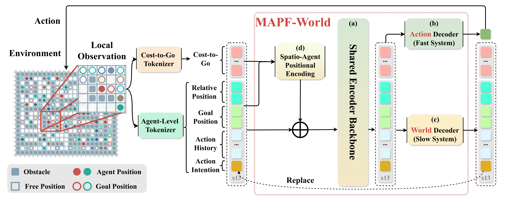
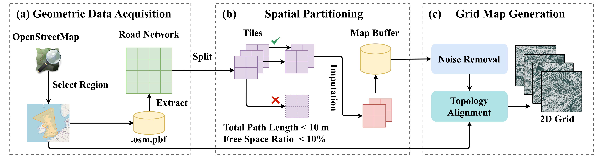
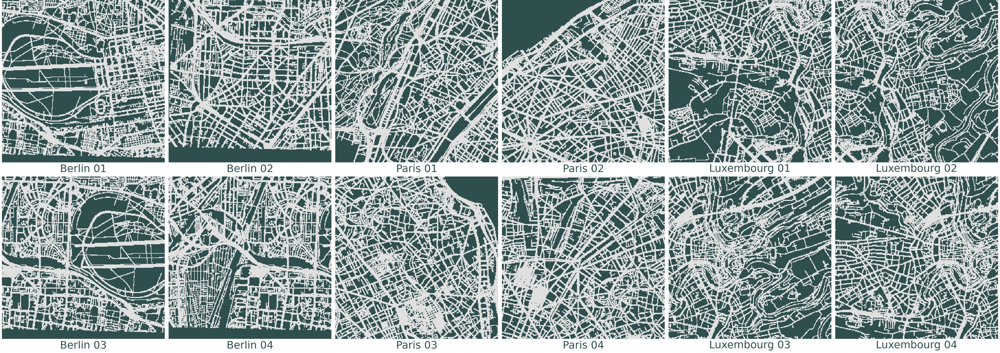

<div align="center">

<sub>IEEE RA-L · 2026</sub>

# MAPF-World: Action World Model for Multi-Agent Path Finding

[](https://doi.org/10.1109/LRA.2026.3726342)
[](#quick-start)
[](https://docs.astral.sh/uv/)
[](#train-the-world-model)
[](LICENSE)

[Architecture](#architecture) · [City Maps](#from-real-streets-to-mapf-worlds) · [Data](#generate-training-data) · [Training](#train-the-world-model) · [Evaluation](#inference-and-benchmarks) · [BibTeX](#citation)

Action generation and short-horizon local prediction for decentralized multi-agent path finding.

</div>

## Architecture

[](assets/figures/fig_architecture.png)

<p align="center"><sub>A shared encoder backbone connects the action decoder (fast system) and world decoder (slow system), with spatio-agent positional encoding.</sub></p>

## From Real Streets to MAPF Worlds

Generate traversable city grids from OpenStreetMap road networks, with configurable physical coverage, resolution and topology-aware filtering.

<details>
<summary>Urban map generation pipeline</summary>

[](assets/figures/fig_generator_pipeline.png)

</details>

[](assets/figures/fig_city_maps.png)

<p align="center"><sub>Berlin · Paris · Luxembourg &nbsp; / &nbsp; 256 × 256 grids · 3.072 km per side<br>Light gray: traversable · Dark slate: obstacles · © <a href="https://www.openstreetmap.org/copyright">OpenStreetMap contributors</a> · <a href="assets/maps">Explore the maps</a></sub></p>

## Quick Start

Create a Conda environment and install dependencies from the repository root:

```bash
conda create -n mapf-world python=3.11 pip -y
conda activate mapf-world
python -m pip install uv
uv pip install -r requirements.txt
```

### Generate a city map

```bash
python -m generator.generate_maps --backend overpass --source 'Paris, France' \
  --country France --city Paris --max-tiles 6 \
  --output-dir outputs/maps/paris
```

<details>
<summary>Local PBF input and map parameters</summary>

```bash
python -m generator.generate_maps --backend pbf --source data/Berlin.osm.pbf \
  --country Germany --city Berlin --output-dir outputs/maps/berlin
```

Set the physical field of view with `--tile-size-m` and grid size with `--grid-resolution` (defaults: 3072 m, 256). Use `--bbox` to select an area from a larger extract. Outputs include maps, previews, metadata and logs.

Run `python -m generator.generate_maps --help` for all options and `python -m generator.generate_maps validate outputs/maps/paris` to check an output directory.

</details>

### Generate training data

Build the expert bridge against your external [LaCAM3](https://github.com/Kei18/lacam3) source checkout:

```bash
python -m generator.generate_dataset build-lacam --source /path/to/lacam3 --output build/liblacam.so

python -m generator.generate_dataset \
  --config generator/configs/10-medium-mazes/10-medium-mazes-part1.yaml \
  --lacam-library build/liblacam.so --output-dir data/train --limit 10
```

On macOS, use `build/liblacam.dylib`. Outputs include Arrow shards and `train.json`. Remove `--limit` to generate the complete training grid.

<details>
<summary>Optional: collect an initial DDG pool from a fixed checkpoint</summary>

```bash
python -m generator.generate_dataset ddg \
  --checkpoint weights/mapf-world-3M.pt --lacam-library build/liblacam.so \
  --output-dir data/ddg --device cuda --seeds 32

python -m generator.generate_dataset world-error \
  --checkpoint weights/mapf-world-3M.pt \
  --output-dir data/world-error --device cuda --seeds 1000
```

DDG selects expert-guided rollback states; world-error selects prediction errors. Both export Arrow shards and `train.json`. Use `--help` for sampling options; the manifest records the achieved sample count.

</details>

### Train the world model

Set `train_manifest` to `data/train/train.json` in `train/configs/small.json`.

```bash
python -m train.main --config train/configs/small.json --no-compile
```

### DDG training

Fine-tune with online DDG using 75% offline data and 25% collected data per minibatch. Set the LaCAM library path in `generator/configs/ddg.json`:

```bash
python -m train.main --config train/configs/ddg-small.json \
  --ddg-collection-config generator/configs/ddg.json --no-compile
```

To use an initial pool and continue collecting during training:

```bash
python -m train.main --config train/configs/ddg-small.json \
  --ddg-manifest data/ddg/train.json \
  --ddg-collection-config generator/configs/ddg.json --no-compile
```

Collection starts at step 0 without an initial pool, or at step 500 with one, then repeats every 500 updates. Each round pauses training, collects with the current model on new map seeds, and appends data to the pool. Round outputs are saved under `runs/world-ddg/ddg/`.

For world-error selection instead, use `--ddg-collection-config generator/configs/world-error.json` (the default in `ddg-small.json`).

<details>
<summary>Fixed-pool training and checkpoint resume</summary>

For fixed-pool training without further collection:

```bash
python -m train.main --config train/configs/ddg-small.json \
  --ddg-collection-config '' --ddg-manifest data/ddg/train.json
```

Resume training, including the data pool and collection schedule:

```bash
python -m train.main --config runs/world-ddg/config.json \
  --resume runs/world-ddg/last.pt
```

`--init-checkpoint` starts a new stage from model weights. `--ddg-ratio` sets the collected fraction of each minibatch. DDP requires at least one Arrow shard per rank in each data source.

</details>

<details>
<summary>Multi-GPU training and input validation</summary>

```bash
python -m train.main --config train/configs/small.json --dry-run

python -m torch.distributed.run --standalone --nproc_per_node=2 -m train.main \
  --config train/configs/small.json --no-compile
```

Run `python -m train.main --help` for all training options.

</details>

<details>
<summary>Training data format</summary>

Create `manifests/train.json`; file paths are relative to the manifest:

```json
{"split": "train", "files": ["../data/train-000.arrow"]}
```

Arrow IPC files contain `obs` and `next_obs` as `fixed_size_list<int8>[256]`
(tokens 0–66), and `next_action` as `int8` (0–4: wait, up, down, left, right).
Use a separate `"split": "validation"` manifest for optional validation.

</details>

### Inference and benchmarks

```bash
# One scenario, with action trace and animation
python -m inference.run --config inference/configs/01-random/01-random.yaml \
  --checkpoint runs/world/last.pt --device cuda \
  --output-dir outputs/inference --animation

# Run the methods and result views defined in YAML
python -m inference.benchmark --config inference/configs/01-random/01-random.yaml \
  --output-dir outputs/benchmark
```

| Configs | Purpose |
|:--|:--|
| [generator/configs](generator/configs) | Training mazes and random maps, split into eight parts |
| [inference/configs](inference/configs) | Eight standard suites: random, mazes, warehouse, Moving AI, puzzles, Europe, large and narrow |

Set methods, weights, devices and parallel backends under `algorithms` in the selected YAML; `results_views` controls tables and plots. Results and logs are saved to a new output directory.

## Citation

If you use MAPF-World in your research, please cite our paper:

```bibtex
@article{yang2026mapfworld,
  title   = {{MAPF-World}: Action World Model for Multi-Agent Path Finding},
  author  = {Yang, Zhanjiang and Li, Yueming and Shen, Yang and Li, Meng and Sun, Lijun},
  journal = {IEEE Robotics and Automation Letters},
  year    = {2026},
  doi     = {10.1109/LRA.2026.3726342}
}
```

## Acknowledgments

Please also cite the relevant original works when building upon their contributions. All entries are available in [references.bib](references.bib).

<details>
<summary>Upstream BibTeX</summary>

```bibtex
@inproceedings{andreychuk2025mapf,
  title     = {{MAPF-GPT}: Imitation Learning for Multi-Agent Pathfinding at Scale},
  author    = {Andreychuk, Anton and Yakovlev, Konstantin and Panov, Aleksandr and Skrynnik, Alexey},
  booktitle = {Proceedings of the AAAI Conference on Artificial Intelligence},
  volume    = {39},
  number    = {22},
  pages     = {23126--23134},
  year      = {2025},
  url       = {https://github.com/CognitiveAISystems/MAPF-GPT}
}

@inproceedings{andreychuk2025advancing,
  title     = {Advancing Learnable Multi-Agent Pathfinding Solvers with Active Fine-Tuning},
  author    = {Andreychuk, Anton and Yakovlev, Konstantin and Panov, Aleksandr and Skrynnik, Alexey},
  booktitle = {2025 IEEE/RSJ International Conference on Intelligent Robots and Systems (IROS)},
  pages     = {10564--10571},
  year      = {2025},
  url       = {https://github.com/Cognitive-AI-Systems/MAPF-GPT-DDG}
}
```

</details>

Code: [MIT License](LICENSE) · Map data: © [OpenStreetMap contributors](https://www.openstreetmap.org/copyright), ODbL.
